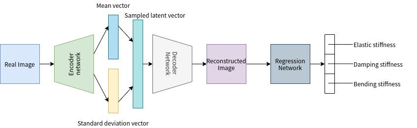
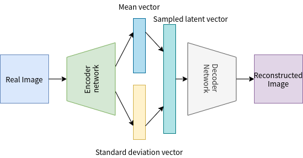
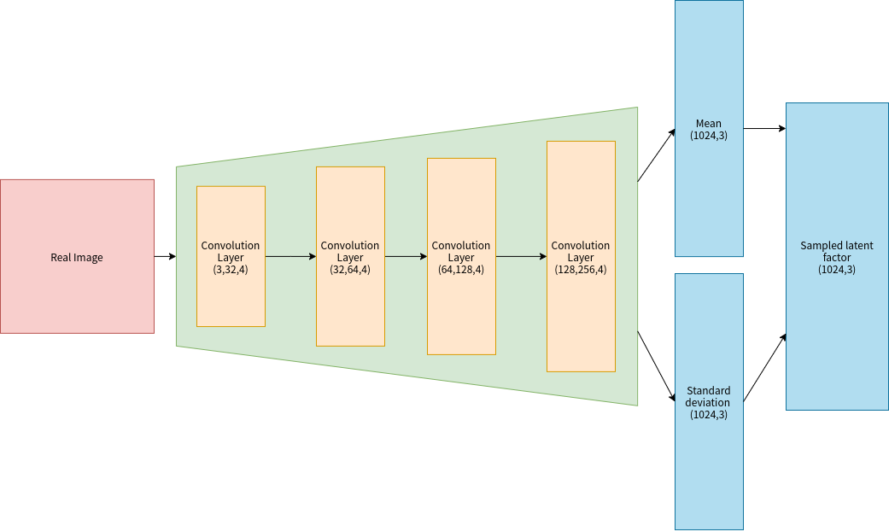
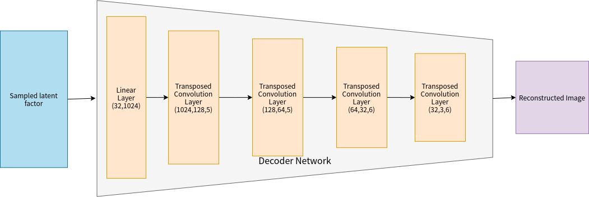

# garment-detection

### Simulation

#### Data collection plan
The data collection plan is to collect RGB data, raw depth data, segmentation data, and depth data in the simulation 
with different physics parameters combination. The simulation is setting different physics of cloth(soft body), 
suspending it from the table and let it fall on the table. The parameters that are available for cloth in this 
experiment are elastic stiffness, damping stiffness, and bending stiffness. I plan to collect 10 values for each 
parameter so I will get 1000 groups of physics parameter settings of cloth. In each group of settings, I collect data 
every 50 frames in the simulation with different camera positions. The result is saved as PNG file and NPZ file.

##### Environment setting
+ Objects setting:
    - Table (with collision, is fixed at its base position and orientation)
    - Cloth (soft body, with collision, movable)
+ Physics setting:
    - Gravity: [0, 0, -10.0] at the all 1500 frames of simulation
    - initial velocity [0, 0, 0.5] for cloth at the first 500 frames of simulation

##### Physics parameters range
+ Elastic Stiffness range: [40.0, 130.0], 10.0 in each step, 10 parameters in total
+ Damping Stiffness range: [0.1, 1.0], 0.1 in each step, 10 parameters in total
+ Bending Stiffness range: [2.0, 20.0], 2.0 in each step, 10 parameters in total

##### Dataset
+ The number of data: 150,000 image in total (1000 physics parameter groups, 30 times of records for one group, 5 camera 
position for each time of record)
+ Dataset directory: ```path to project/simulation/data```  
    - Label: In the filename, ```(1)_(2)_(3)_(4)_(5)_(6).png or (1)_(2)_(3)_(4)_(5)_(6).npz```
        + (1) value of springElasticStiffness
        + (2) value of springDampingStiffness
        + (3) value of springBendingStiffness
        + (4) Iteration of data collection
        + (5) Camera position, 5 kind of position in total, (labeled as 0, 1, 2, 3, 4)
        + 40.0_0.1_2.0_1_0.png means [springElasticStiffness=40.0, springDampingStiffness=0.1, springBendingStiffness=2.0,
        iteation=1, camera_position=0], a RGB image. 
    - RGB directory: ```path to project/simulation/data/rgb```  
        + PNG file
    - Data directory: ```path to project/simulation/data/bin```
        + NPZ file, an compressive file for binary numpy array including raw depth data (include depth of table and cloth), 
        segmentation data (include segmentation of table and cloth) and depth data (only include cloth) 
        + How to open: 
        ```python
      import numpy as np
      import matplotlib.pyplot as plt
      
      data = np.load('path to file')
      raw_depth = data['raw_depth']
      segmentation = data['segmentation']
      depth = data['depth']
      
      plt.imshow(depth) # or plt.imshow(raw_depth) or plt.imshow(segmentation)
      plt.show()
        ```
 
#### How to use the code of simulation
1. Install all necessary packages by using ```pip install -r requirements.txt``` 
2. Run the script directly ```python ./simulation/init_world.py```

### Project initial documentation

#### Background
Learning physics parameters of soft body is difficult. From the world model paper, we know that the real environment can
be recorded by the Variation Auto-encoder model. As a result, I want to use a Variation Auto-encoder to store physics 
parameters in the latent factor and reproduce reconstructed images. Then a simple neural network could be used as a 
controller as the world model paper to predict the stiffness information of soft body.

#### Implementation
This is a classification task. I use a Variational Auto-encoder to record the rgb and depth information in the latent 
vector and produce reconstructed image. Then I use a regression neural network to predict the stiffness of image.

###### Overall structure


###### Network structure
+ Variational Auto-encoder



+ Regression network
A neural network with 3 linear layers and 1 ReLU activation layer

#### Hypothesis
The vae model can record the physics parameters in latent factor and reproduce it to a reconstructed image, and the 

#### Expected Results
The Variation Auto-encoder reproduce similar image with the input and the regression neural network predict same physics 
parameters with the labels of images.

#### Reference
[1] Kingma, D.P. and Welling, M., 2013. Auto-encoding variational bayes. arXiv preprint arXiv:1312.6114.  
[2] Doersch, C., 2016. Tutorial on variational autoencoders. arXiv preprint arXiv:1606.05908.  
[3] Ha, D. and Schmidhuber, J., 2018. World models. arXiv preprint arXiv:1803.10122.  
[4] World model website: https://worldmodels.github.io/  
[5] Pytorch VAE example: https://github.com/pytorch/examples/tree/master/vae
[6] Pytorch Tutorials - Writing Custom Datasets, DataLoaders and Transforms: https://pytorch.org/tutorials/beginner/data_loading_tutorial.html 

